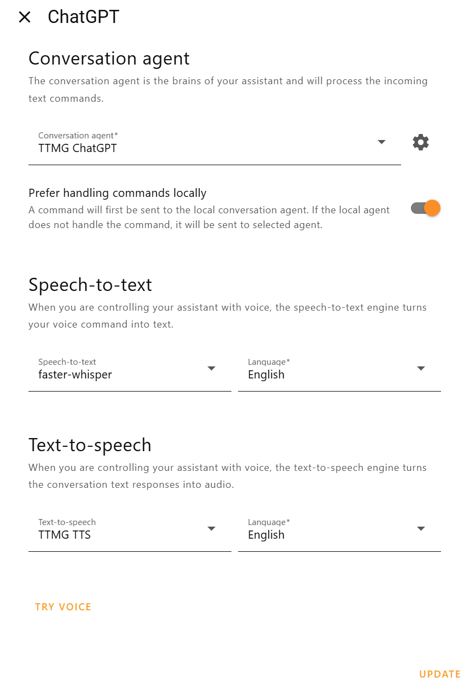

# Talk To Me Goose 


Streaming LLM's output directly into TTS sytems in real time, to improve experience with Home Assistant Voice devices on long outputs.

## What is the problem?

Home Assistant Voice Preview Edition (HAVPE) devices are amazing, but they do not handle long TTS responses that well, resulting in them silently failing on long audio responses. 

Let's say you are using a LLM in your pipeline and you try to announce via a TTS system a response to a prompt like "Tell me a story about home assistant":

*You send a request to the LLM => it takes 10 seconds to generate the output text => you will NOT get any response because there is a **5 second timeout** in HAVPE devices; in the HAVPE logs you will see `“HTTP_CLIENT: Connection timed out before data was ready!”`.*

## Our approach

This solution streams the response of your LLM directly into your TTS engine of choice, allowing it to reply quickly even for long responses (around 3-5 seconds; your mileage might vary depending on the TTS engine/model). So now if you ask your LLM to tell you a long story, you don't have to wait 30 seconds to get a response. The flow would look like:

*You send a request to the LLM => the response is read token by token in real time until we hit an end of a sentence => the sentence is sent to your TTS system => we immediately stream the audio => the audio stream starts a few seconds after your request => as more sentences are processed, they are added in real-time to the audio stream*

## Supported LLM/TTS engines

**LLMs:**
1. OpenAI

**TTS engines:**
1. OpenAI
2. Google Cloud
3. ElevenLabs
4. Wyoming-piper

## Getting started
1. Read the [Known issues](#known-issues). These should not be a problem for most people, but make sure you are aware of the limitations.
2. Ensure you have [ESPHome Device Builder](https://esphome.io/guides/getting_started_hassio.html#installing-esphome-device-builder) installed (as a HASS addon or separately, it does not matter).
3. Adopt your HAVPE device in ESPHome Device Builder. It will break your [automatic update notifications](https://voice-pe.home-assistant.io/guides/update/).

Now you can set everything up in 5 easy(-ish) steps!

## Step 1: Installation - Server

1. Clone the repo.
2. Run the setup script with `./setup.sh` for Unix-based systems (make sure to run `chmod +x setup.sh` first) or `start.bat` for Windows. It will create a virtual environment and install the required dependencies.
3. Edit `configuration.json` and add your OpenAI API key to the `main` section ([get it here](https://platform.openai.com/settings/organization/api-keys)). This is the only required parameter, but there are additional optional settings you can further configure - see [Configuration](https://github.com/eslavnov/llm-stream-tts#configuration).

## Step 2: Configuration - Server
**General settings**

General settings go under `"main"` in the `configuration.json`.  You need to provide only the `"openai_api_key"`, the rest have default values.

```
{
  "main":{
    "openai_api_key": <your-openai-api-key>,
    "llm_model": <model-to-use>, # https://platform.openai.com/docs/models
    "llm_system_prompt": <system-prompt>, # Default system prompt that is applied to all requests. TTMG Conversation will overwrite it, so you usually don't need it.
    "max_completion_tokens": 400, # Additional model settings
    "temperature": 1.0, # Additional model settings
    "top_p": 1.0, # Additional model settings
    "tts_engine": <selected-tts-engine>, # Selected TTS engine
    "host": <service-host>, # Host to serve 
    "port": <service-port> # Port to serve
  }
}
```

**TTS settings - OpenAI**

This engine is enabled by default. If you have already provided your OpenAI API key in the `"main"` section, you are good to go!
```
{
    "main": {
      "tts_engine": "openai",
      ...
    },
    "openai": {
      <optional parameters>
    }
}
```
You can pass additional parameters in your `configuration.json`, see `configuration_examples/configuration_openai.json` for all supported options.

**TTS settings - Google Cloud**

1. First you need to obtain a service account file from Google Cloud. Follow [these instructions](https://www.home-assistant.io/integrations/google_cloud/#obtaining-service-account-file), you need only text-to-speech.
2. Change `tts_engine` to `google_cloud` in your `configuration.json`.
3. Add Google Cloud settings to the `configuration.json`. Only the `"credentials_path"` is required, the rest have default values:
```
{
    "main": {
      "tts_engine": "google_cloud",
      ...
    },
    "google_cloud": {
      "credentials_path": "creds.json"
    }
}
```
You can pass additional parameters in your `configuration.json`, see `configuration_examples/configuration_google_cloud.json` for all supported options.

**TTS settings - Elevenlabs**
1. First you need to obtain an API key from ElevenLabs. Get it [here](https://elevenlabs.io/app/settings/api-keys).
2. Change `tts_engine` to `elevenlabs` in your `configuration.json`.
3. Add ElevenLabs settings to the `configuration.json`. Only the `"api_key"` is required, the rest have default values:
```
{
    "main": {
      "tts_engine": "elevenlabs",
      ...
    },
    "elevenlabs": {
      "api_key": "<your-elevenlabs-api-key>"
    }
}
```
You can pass additional parameters in your `configuration.json`, see `configuration_examples/configuration_elevenlabs.json` for all supported options.

**TTS settings - Wyoming-piper**
1. Change `tts_engine` to `piper` in your `configuration.json`.
3. Add wyoming-piper settings to the `configuration.json`. All have default values (see below):
```
{
    "main": {
      "tts_engine": "piper",
      ...
    },
    "piper": {
      "host": "127.0.0.1",
      "port": "10300",
      "voice_name": "en_GB-alan-medium"
    }
}
```
You can pass additional parameters in your `configuration.json`, see `configuration_examples/configuration_piper.json` for all supported options.


## Step 3: Installation - Home Assistant

Follow the instructions to install [TTMG Conversation](https://github.com/eslavnov/ttmg_conversation) and [TTMG TTS](https://github.com/eslavnov/ttmg_tts). You will need to provide the url to your TTMG Server in a format of `http://<TTMG-Server-ip->:<port>`.

## Step 4: Configuration - Home Assistant
Provided that you have already installed TTMG Conversation and TTMG TTS integrations, then in Home Assistant:
1. Go to Settings => Voice Assistant
2. Select the assistant you want to use with TTMG
3. Set the Conversation agent and Text-to-speech to TTMG components



Now this assistant is talking to TTMG Server! You can try to start a conversation in HASS with it and you will get back "Processing your request, please wait..." - this is OK! Unfortunately, integrating real-time streaming breaks this, but no worries - your HAVPE devices will work great - set them up in the next step!

##  Step 5: Configuration - HAVPE devices
This is the final step - now we are going to fix/break some things in your HAVPE firmware to make it work with TTMG Server. 

Each HAVPE device needs to be set up individually, but it's a one-time operation:
1. Get your `device_id` from home assistant. Go to Automations, create a new one, select device as a trigger, choose your HAVPE device and then switch to yaml view to get it. Don't save the automation, you just need to find out the `device_id`.
2. Run `generate_esphome_config.sh`. It will ask you for the `device_id` and TTMG Server's host and port. It will then grab the latest HAVPE config from the official repo and will apply two changes: 
    - Increase the default timeout to 15s (not really needed, but a good safety net in case LLM takes a long time to start generating a response for some reason)
    - Make it always fetch `/play/{client_id}.flac` from the TTMG Server instead of TTS responses. WARNING: this means that using any other assistants with this HAVPE device would fail since it will only talk to TTMG Server.
3. The script will output a path to the folder with customs components for your particular HAVPE device.
4. Add the following to your device's yaml configuration in [ESPHome Device Builder](https://esphome.io/guides/getting_started_hassio.html#installing-esphome-device-builder) to apply the changes. To revert, simply remove/comment this block:
```
external_components:
  - source:
      type: local
      path: <output-of-the-generate_esphome_config.sh-script>
```
5. Install the modified config and you are done!

## Usage
Run the main script with `./start.sh` for Unix-based systems (make sure to run `chmod +x start.sh` first) or `start.bat` for Windows. It will start a small API server (at http://0.0.0.0:8888 using the default settings). See [an example](example.service) of Unix service file to make it run automatically.

Now ask your HAVPE device to tell you a long story and see how it goes!

## Known issues
1. What breaks:
    - The custom firmware breaks TTS for other assistants on that device, because it overwrites the output url to TTMG Server.
    - TTMG integrations do not work with HASS web conversations. Probably not fixable?
    - Debug in HASS will not produce any meaningful data since TTMG Server handles everything.
2. For now, the logic for splitting the stream into sentences is very rudimental, so sentences like "What a nice day, Mr. Smith!" will be parsed as two sentences: ["What a nice day, Mr.", "Smith!"]. This might result in some weird pauses/strange tempo when this happens. Is this fixable? Yes! Will I fix it (soon)? I dunno!
3. The text is sent to TTS systems sentence-by-sentence, so TTS has no awareness of the surrounding context. Usually it's not a problem, but sometimes it might affect the intonations.

## Endpoints
All the endpoints are internal and provided for information purposes only. You don't need to use any of them.

1. `/preload/{client_id}` (POST) - Accepts JSON {"messages", "tools", "model", "max_completion_tokens", "top_p" and "temperature"}. Used by TTMG Conversation.
2. `/preload-text/{client_id}` (POST) - Accepts JSON {"text": "..."}. Used to pass the text to `/tts_say` endpoint.
3. `/tts_say/{client_id}.flac` (GET) - Triggers TTS and returns flac audio for a text preloaded  via  `/preload-text/{client_id}`.
4. `/play/{client_id}.flac` (GET) - Triggers LLM+TTS and returns flac audio for a prompt and model settings preloaded via `/preload/{client_id}`.
5. `/history/{client_id}` (GET) - Returns LLM conversation history for a client.
6. `/write_history/{client_id}` (POST) - Writes LLM conversation history for a client.

## Change log

### v1.0.0
**Added**
- Waaaaaay too much stuff to mention, see the new README.md!

### v0.0.6
**Added**
- Support for Wyoming-piper TTS engine

### v0.0.5
**Added**
- Client store so we can support multiple HAVPE devices
- Per client event blockers

### v0.0.4
**Added**
- Flac support so we can play the output natively on HAVPE

### v0.0.3
**Added**
- `/tts` endpoint to generate audio from the TTS engine based on the provided text (skipping the LLM step)
- Better logs

### v0.0.2
**Added**
- ElevenLabs TTS engine

### v0.0.1
- Initial commit

