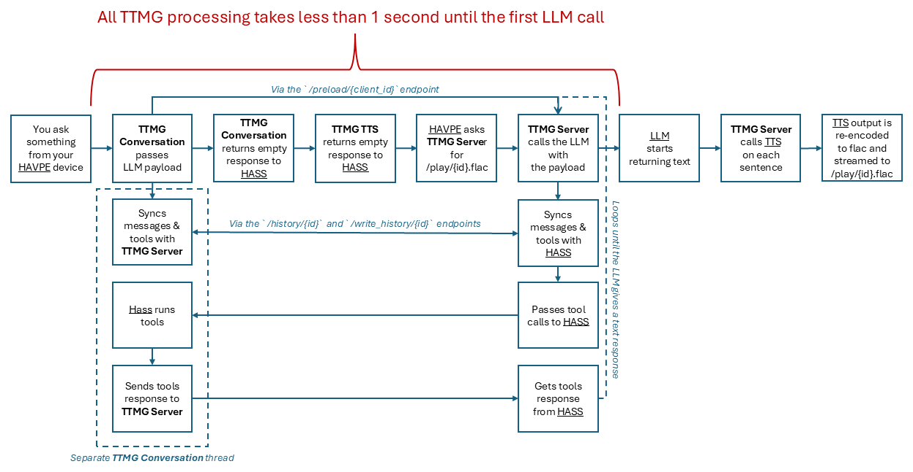

# Talk To Me Goose - Stream LLM responses into TTS engines


> [!IMPORTANT]  
> I am pausing the active development on this project as the Home Assistant team are working on a native implementation that will work with all TTS/AI providers in Home Assistant out of the box.

Welcome to **Talk To Me Goose**! This tool streams your LLM's (Large Language Model) output directly into your TTS (Text-to-Speech) engine, delivering real-time responses without the long waits. Perfect for enhancing your Home Assistant Voice devices with long text-to-audio outputs.

**Demos:**
<div style="display: flex; justify-content: center; gap: 10px;">
  <a href="https://www.youtube.com/watch?v=vHryYHMi8jI">
    
  </a>
  <a href="https://www.youtube.com/watch?v=ZKTXFBypuI0">
    
  </a>
</div>

**What's inside:**
* [What is the problem?](#what-is-the-problem)
* [Our approach](#our-approach)
* [Supported LLM/TTS engines](#supported-llmtts-engines)
* [Getting started](#getting-started)
    * [Step 1: Server Installation](#step-1-server-installation)
    * [Step 2: Server Configuration](#step-2-server-configuration)
    * [Step 3: Home Assistant Installation](#step-3-home-assistant-installation)
    * [Step 4: Home Assistant Configuration](#step-4-home-assistant-configuration)
    * [Step 5: HAVPE Devices Configuration](#step-5-havpe-devices-configuration)
* [Usage](#usage)
* [Known issues](#known-issues)
* [Change log](#change-log)
* [[For nerds] Endpoints](#for-nerds-endpoints)
* [[For nerds] General flow](#for-nerds-general-flow)

## What is the problem?

Home Assistant Voice Preview Edition (HAVPE) devices are great, but they're not so good at handling long responses. In fact, they might just fail silently when asked for anything too lengthy. If your HAVPE device sometimes goes quiet after your command (but works fine on repeat or with other commands), this is probably why.

Imagine you ask your LLM to tell you a story about Home Assistant:

1. You send the request to the LLM.
2. The LLM takes its sweet time - let's say 10 seconds - to generate a response.
3. **Silence**... because there's a **5-second timeout** in HAVPE devices, and no response ever comes. In your HAVPE device log you will see `HTTP_CLIENT: Connection timed out before data was ready!`.

Even if you manually [increase the timeout](https://community.home-assistant.io/t/http-timeout-for-voice-assistant-pe-even-though-the-response-is-recieved/834200/4?u=gyrga), you'll still be left waiting for 15 seconds: 10 for the LLM, plus an extra 5 for TTS processing.

## Our approach

**Talk To Me Goose** streams your LLM’s output directly to the TTS engine. This means no more waiting around for the full response to be generated before your device starts talking back. With this approach, responses are streamed token-by-token, so you get audio while the text is still being generated. It looks like this:

1. You send a request to the LLM.
2. The LLM responds token by token, which is passed to the TTS engine as soon as it hits a complete sentence.
3. The audio begins almost immediately, and as more sentences arrive, they are added in real-time.

The result: fast responses with no waiting, even for long stories! Tool calls, message history and local conversation agent's responses are supported, too!


## Supported LLM/TTS engines

**LLMs:**
1. OpenAI

**TTS engines:**
1. OpenAI
2. Google Cloud
3. ElevenLabs
4. Wyoming-piper

## Getting started
1. Check the [Known issues](#known-issues).
2. Install [ffmpeg](https://www.ffmpeg.org/) - required for audio stream conversion.
3. Install [ESPHome Device Builder](https://esphome.io/guides/getting_started_hassio.html#installing-esphome-device-builder) - you can do this as a Home Assistant addon or separately, whichever you prefer.
4. Adopt your HAVPE device in ESPHome Device Builder (note: it will *break* your [automatic update notifications](https://voice-pe.home-assistant.io/guides/update/)).

Now you can set everything up in 5 easy(-ish) steps! Follow the steps below to:
1. Install TTMG Server
2. Configure TTMG Server
3. Install Home Assistant integration
4. Configure Home Assistant to work with TTMG
5. Configure your Home Assistant Voice Preview Edition (HAVPE) device(s) to work with TTMG

## Step 1: Server Installation

1. Clone the repo.
2. Run the setup script with `./setup.sh` for Unix-based systems or `start.bat` for Windows. It will create a virtual environment, install the required dependencies and create `configuration.json` to store your settings.
3. Edit `configuration.json` and add your OpenAI API key to the `main` section ([get it here](https://platform.openai.com/settings/organization/api-keys)). This is the only required parameter, but there are additional optional settings you can further configure - see the next step.

## Step 2: Server Configuration
**General settings**

General settings go under `"main"` in the `configuration.json`.  You need to provide only the `"openai_api_key"`, the rest have default values.

```
{
  "main":{
    "openai_api_key": <your-openai-api-key>,
    "llm_model": <model-to-use>, # https://platform.openai.com/docs/models, TTMG Conversation will overwrite it
    "llm_system_prompt": <system-prompt>, # Default system prompt that is applied to all requests. TTMG Conversation will overwrite it, so you usually don't need it
    "max_completion_tokens": 400, # Additional model settings, TTMG Conversation will overwrite it
    "temperature": 1.0, # Additional model settings, TTMG Conversation will overwrite it
    "top_p": 1.0, # Additional model settings, TTMG Conversation will overwrite it
    "tts_engine": <selected-tts-engine>, # Selected TTS engine
    "host": <service-host>, # Server host 
    "port": <service-port> # Server port
  }
}
```
<details>
  <summary>TTS settings - OpenAI (Default)</summary>
   
   This engine is enabled by default. If you have already provided your OpenAI API key in the `"main"` section, you are good to go!
   ```
   {
       "main": {
         "tts_engine": "openai",
         ...
       },
       "openai": {
         <optional parameters>
       }
   }
   ```
   You can pass additional parameters in your `configuration.json`, see `configuration_examples/configuration_openai.json` for all supported options.
</details>

<details>
  <summary>TTS settings - Google Cloud</summary>
   
1. First you need to obtain a service account file from Google Cloud. Follow [these instructions](https://www.home-assistant.io/integrations/google_cloud/#obtaining-service-account-file), you need only text-to-speech.
2. Change `tts_engine` to `google_cloud` in your `configuration.json`.
3. Add Google Cloud settings to the `configuration.json`. Only the `"credentials_path"` is required, the rest have default values:
```
{
    "main": {
      "tts_engine": "google_cloud",
      ...
    },
    "google_cloud": {
      "credentials_path": "creds.json"
    }
}
```
You can pass additional parameters in your `configuration.json`, see `configuration_examples/configuration_google_cloud.json` for all supported options.
</details>

<details>
  <summary>TTS settings - Elevenlabs</summary>
   
1. First you need to obtain an API key from ElevenLabs. Get it [here](https://elevenlabs.io/app/settings/api-keys).
2. Change `tts_engine` to `elevenlabs` in your `configuration.json`.
3. Add ElevenLabs settings to the `configuration.json`. Only the `"api_key"` is required, the rest have default values:
```
{
    "main": {
      "tts_engine": "elevenlabs",
      ...
    },
    "elevenlabs": {
      "api_key": "<your-elevenlabs-api-key>"
    }
}
```
You can pass additional parameters in your `configuration.json`, see `configuration_examples/configuration_elevenlabs.json` for all supported options.
</details>

<details>
  <summary>TTS settings - Wyoming-piper</summary>
   
1. Change `tts_engine` to `piper` in your `configuration.json`.
2. Add wyoming-piper settings to the `configuration.json`. All have default values (see below):
```
{
    "main": {
      "tts_engine": "piper",
      ...
    },
    "piper": {
      "host": "127.0.0.1",
      "port": "10300",
      "voice_name": "en_GB-alan-medium"
    }
}
```
You can pass additional parameters in your `configuration.json`, see `configuration_examples/configuration_piper.json` for all supported options.

</details>

## Step 3: Home Assistant Installation

Follow the instructions to install [TTMG Conversation](https://github.com/eslavnov/ttmg_conversation) integration for Home Assistant. You will need to provide the url to your TTMG Server in the format of `http://<TTMG-Server-ip->:<port>`.

## Step 4: Home Assistant Configuration
Once you have installed TTMG Conversation integration, then in Home Assistant:
1. Go to Settings => Voice Assistant
2. Select the assistant you want to use with TTMG
3. Set the Conversation agent and Text-to-speech to TTMG components
   


Now this assistant is talking to the TTMG Server! You can try to start a conversation in HASS with it and you will get back "Processing your request, please wait..." - this is OK! Unfortunately, integrating real-time streaming breaks this, but no worries: your HAVPE devices will work great - set them up in the next step!

##  Step 5: HAVPE devices Configuration
The final step: let's get your HAVPE devices talking to the TTMG Server.

Each HAVPE device needs its own configuration. Don't worry, it's a one-time thing:
1. Get your `device_id` from home assistant. Go to Automations, create a new one, select "device" as a trigger, choose your HAVPE device and then switch to the yaml view to get it. Don't save the automation, you just need to find out the `device_id`.
2. Run `python generate_esphome_config.py`. It will ask you for the `device_id` and the TTMG Server's host and port. It will also ask you for the preferred audio format - flac (default) or mp3 (faster, experimental). It will then grab the latest HAVPE config from the official repo and will apply two changes: 
    - Increase the default timeout to 15s (not really needed, but a good safety net in case LLM takes a long time to start generating a response for some reason)
    - Make it always fetch `/play/{client_id}.flac` (or `/play/{client_id}.mp3`) from the TTMG Server instead of TTS responses. WARNING: this means that using any other assistants with this HAVPE device would fail since it will only talk to the TTMG Server.
3. The script will output a path to the folder with patched components for your particular HAVPE device.
4. Add the following code block to your device's yaml configuration in [ESPHome Device Builder](https://esphome.io/guides/getting_started_hassio.html#installing-esphome-device-builder) to apply the changes. To revert, simply remove/comment this block:
    ```
    external_components:
      - source:
          type: local
          path: <output of tools/generate_esphome_config.py>
    ```

    If you want to use the mp3 audio format, you also need to add this block to your config:
    ```
    media_player:
      - platform: speaker
        id: !extend external_media_player
        announcement_pipeline:
          speaker: announcement_resampling_speaker
          format: MP3 
    ```
5. Install the modified config and you are done!

## Usage
Run the main script with `./start.sh` for Unix-based systems or `start.bat` for Windows. It will start a small API server (at http://0.0.0.0:8888 using the default settings). See [an example](configuration_examples/example.service) of a Unix systemd service to make it run automatically.

Now ask your HAVPE device to tell you a long story and see how it goes!

## Known issues
1. **Breaking Changes**
   - The custom firmware overwrites TTS URLs, so you can't use other TTS engines with the HAVPE voice assistants. Using `tts.speak` action will still work with other TTS engines, though. See [here](https://github.com/eslavnov/ttmg_server/issues/3) for more details.
     
      **Solution:** Use the TTMG TTS for voice assistant settings, use native TTS integrations for things like `tts.speak`.
   - TTMG integration doesn't play well with HASS web conversations (not fixable until HASS natively supports text and audio streaming). 

      **Solution:** Do not use it with the web assistant! ¯\\_(ツ)_/¯
   - Debugging in HASS won’t show meaningful data since everything is handled by the TTMG Server. 

      **Solution:** Check the TTMG Server logs for some basic debug info.
2. ~~**Sentence Parsing:**~~
   - ~~The sentence-splitting logic isn't perfect. It might split “What a nice day, Mr. Smith!” into “What a nice day, Mr.” and “Smith!” causing awkward pauses.~~
     
      **Solution:** Fixed in v1.0.3.
3. **Context-Awareness:**
   - TTS engines have no idea about the context because we send one sentence at a time. This sometimes affects intonation and/or pauses between sentences, but in my testing (mostly with Google Cloud TTS) the difference is negligible.


## Change log

### v1.0.4
**Added**
- You can now choose to skip re-encoding to flac and stream MP3 data from the TTS engines directly into your HAVPE devices. To use MP3, you will have to generate & install a new HAVPE config with the updated `tools/generate_esphome_config.py`. Upside: now the responses start streaming a bit faster, I get 3-4 seconds on average before the audio starts playing (gpt-4o-mini + Google Cloud TTS). Downside: HAVPE by default uses FLAC since it is less demanding, so you tell me if you notice any issues! 

### v1.0.3
**Added**
- New sentence parser! Just as fast as the old one, but handles titles, abbreviations and other tricky stuff correctly. No more awkward pauses!
- Updated `tools/generate_esphome_config.py` to support the latest HAVPE firmware and esphome 2025.2.0.

**Fixed**
- Windows compatibility (does not use `/dev/null` anymore)

### v1.0.2
**Added**
- Local conversation agent's responses are now working too! Make sure to update your TTMG Home Assistant integration! 

### v1.0.1
**Changed**
- Minor code refactoring for readability 
- Updated README.md

### v1.0.0
**Changed**
- Complete rewrite of the app to support native streaming to HAVPE devices, see the new README.md!

### v0.0.6
**Added**
- Support for Wyoming-piper TTS engine

### v0.0.5
**Added**
- Client store so we can support multiple HAVPE devices
- Per client event blockers

### v0.0.4
**Added**
- Flac support so we can play the output natively on HAVPE

### v0.0.3
**Added**
- `/tts` endpoint to generate audio from the TTS engine based on the provided text (skipping the LLM step)
- Better logs

### v0.0.2
**Added**
- ElevenLabs TTS engine

### v0.0.1
- Initial commit

## [For nerds] Endpoints
Most of the endpoints are used by TTMG components and usually you don't need to call them directly (marked as [Internal]). Instead use [External] ones for the best experience.

1. [Internal] `/preload/{client_id}` (POST) - Accepts JSON {"messages", "tools", "model", "max_completion_tokens", "top_p" and "temperature"}. Used by TTMG Conversation and by internal TTMG Server logic. It is not recommended to call it unless you know what you are doing.
2. [Internal] `/history/{client_id}` (GET) - Returns LLM conversation history for a client.
3. [Internal] `/write_history/{client_id}` (POST) - Writes LLM conversation history for a client.
4. [External] `/preload-text/{client_id}` (POST) - Accepts JSON {"text": "..."}. Passes the text to `/tts_say` endpoint. Use it if you want to send a long text directly to the TTS engine.
5. [External] `/tts_say/{client_id}.flac` (GET) - Triggers TTS and returns flac audio for a text preloaded  via  `/preload-text/{client_id}`. Will not call your LLM, it will just announce the text.
4. [Internal/External] `/play/{client_id}.flac` (GET) - Triggers LLM+TTS and returns flac audio. 
    - When the prompt and model settings were preloaded via `/preload/{client_id}`, it acts in an [Internal] mode and runs the LLM-TTS pipeline.
    - When the text was preloaded via `/preload-text/ttmg_tts`, it acts in an [Internal] mode and runs the TTS pipeline directly, skipping the LLM step (used for announcing local agent responses, for example)
    - When called directly with a prompt like `/play/{does-not-matter}.flac?prompt=Tell+me+a+story+about+home+assistant`, uses that prompt and llm settings from your `configuration.json`.

## [For nerds] General flow

